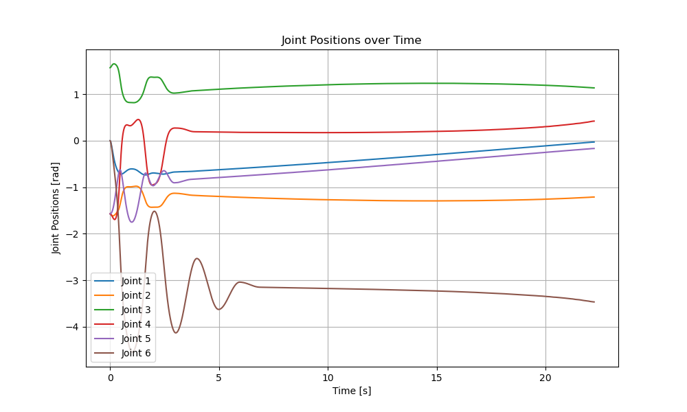
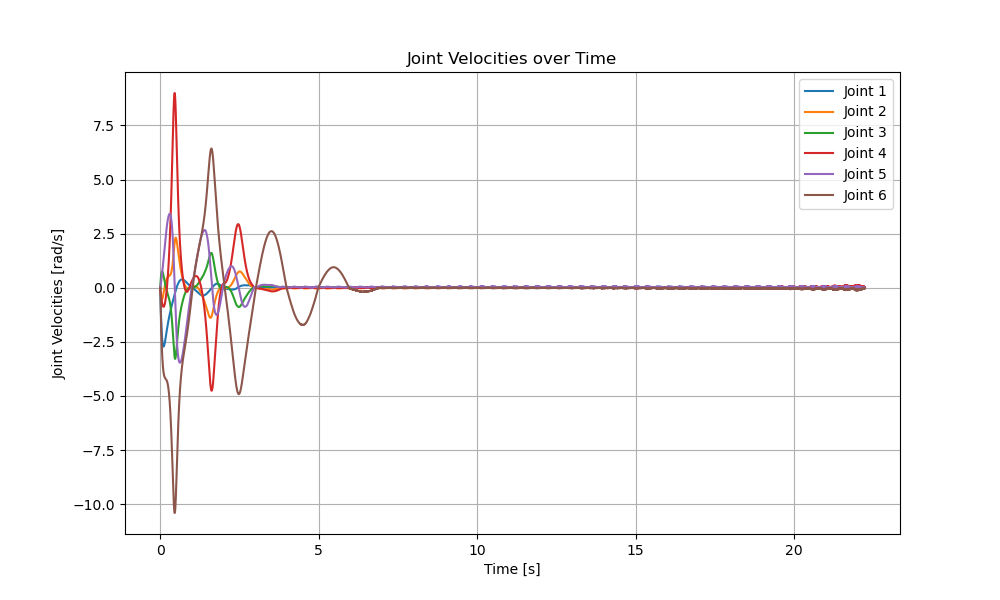

# Task Space Inverse Dynamics

This repo is a copy of [forc](https://github.com/simeon-ned/forc/tree/master/hw) and contains implementation of Task Space Inverse Dynamics. The algorithm is taken from book "Robot Modeling and Control" by Mark W. Spong, Seth Hutchinson, and M. Vidyasagar.

## Navigation

- Videos are saved in `logs/videos/`. The solution for TSID is in `05_joint_space.mp4`.
- Plots are saved in `logs/plots/`. The joint positions are on `05_positions.png` velocities are on `05_velocities.png`.
- All my notes and equations are in `notes/2024-12-12-Note-10-24_annotated.pdf`.
- `05_TSID.py`: TSID implementation and simulation on a straigth line trajectory. 
- All examples use the UR5e robot model.

The structure of the repository is as follows:
```bash
├── logs/
│ ├── videos/ # Simulation recordings
│ └── plots/ # Generated plots
├── robots/ # Robot models
└── simulator/ # Simulator class
└── notes/ # Equations taken from book and all math presented here
```

## Results

I generated a trajectory - straigth line with `start=[0.5, -0.2, 0.5]`, `end=[0.5, 0.2, 0.5]` in [x, y, z] world frame coordinates, trajectory of end effector has a constant orientation described as unit quatrenion. 

### Joint positions during trajectory traversing


### Joint velocities during trajectory traversing


## Conclusion

Task Space Inverse Dynamics control equations were obtained and simulation implemented. This method allows to generate control signals based on the end effector position in task-space. 

The first point of trajectory was achieved only after ~6.5 seconds from start, it indicates that $K_p$ and $K_d$ gains should be tuned more. After the robot achieves first point on trajectory it easily follows the path with constant orientation. 